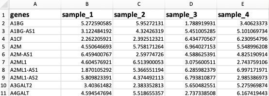

Your data should be uploaded as either an Excel spreadsheet or text-based file with tab, comma or semi-colon separators. Samples must be in columns and genes in rows: The first column should contain either gene symbols or gene ENSEMBL IDs:

 

 

Moreover the expression values should be appropriately normalised to account for sequencing depth: The units should be either **FPKM** (fragments per kilobase million); **TMP** (transcripts per million) or **CPM** (counts per million). 
