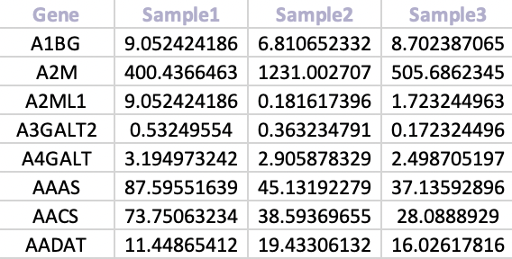

The expression data can be in either a .csv, .tsv or .xlsx file format, with samples in columns and genes in rows. The first column of the data must also contain the gene symbols:

 

The expression values in the data should be appropriately normalised to account for sequencing depth, an in either:

-   **FPKM** - fragments per kilobase million

-   **RPKM** - reads per kilobase million

-   **TMP** - transcripts per million

-   **CPM** - counts per million

Moreover, All expression values must ***NOT*** be on a logarithmic scale, as they will scaled during processing.
